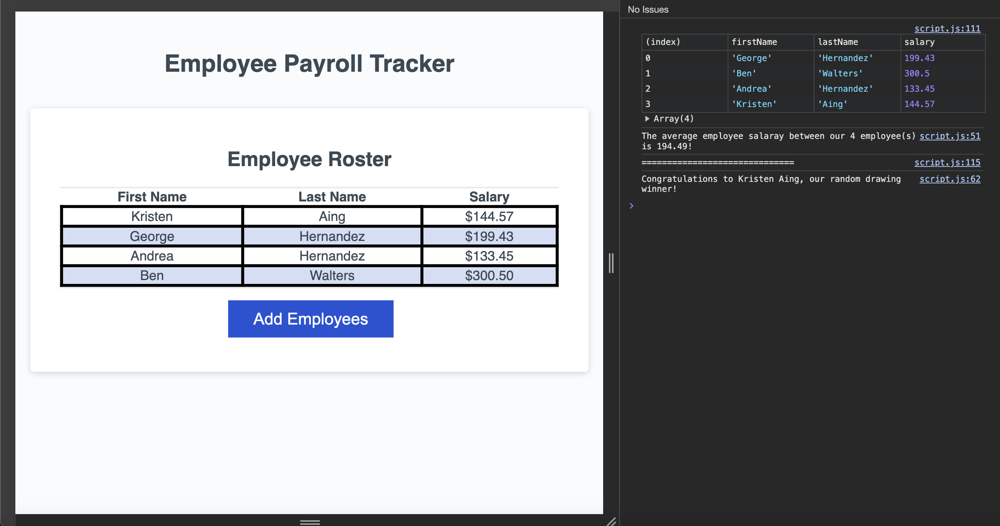

# employee-log

## Description

- The motivation behind this project was to create three funtions to complete the employee log.
 1. To gather user input to create and return an array of employee objects.
 2. Calculate and display the average salary in the console log.
 3. Generate a random employee and display in the console log.

- It solves the issue of not retaining employees or displaying it in the table. It also turns the data into readable information.
- Working on this project really pushed me to understand javascript at a molecular level. Being able to read what is actually happening was essential to solving the issues. This project really made things click.

Live site: https://ghern5234.github.io/employee-log/

